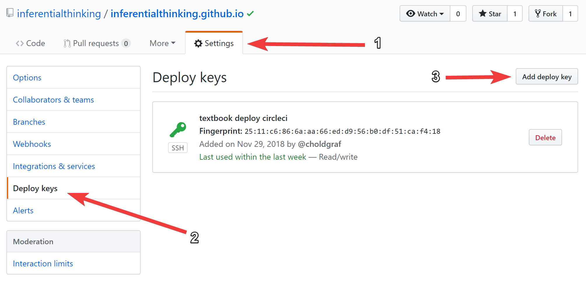
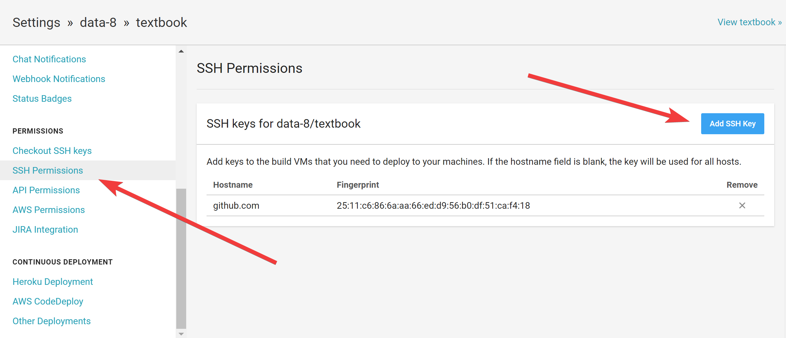
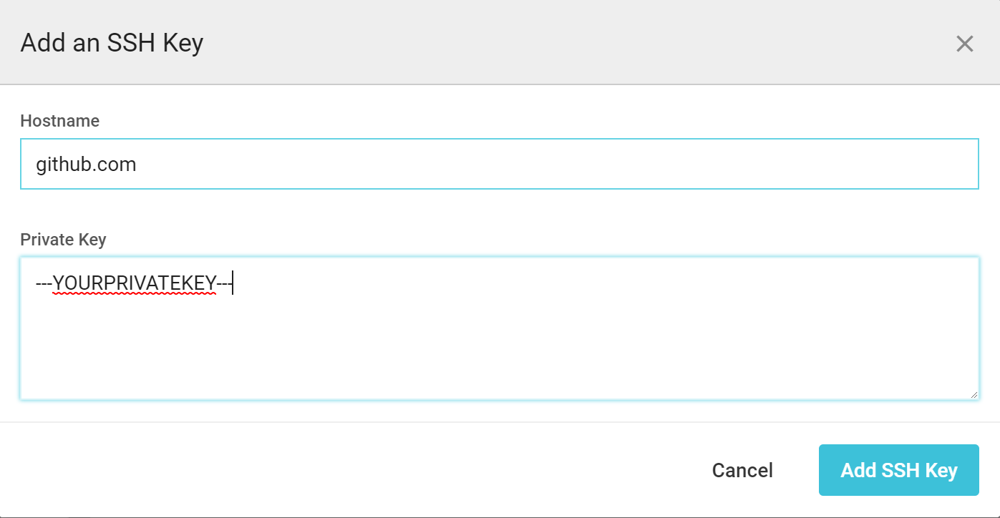

# Automatically mirror a github repository with CircleCI

> tl;dr: you can automatically mirror the contents of one repository to another by
  using CI/CD services like CircleCI. This post shows you one way to do it using
  secrets that let you push to a GitHub repository from a CircleCI process.

We recently ran into an issue with the Data 8 course where we needed to mirror
one GitHub site to another. In short, the textbook is built with a tool called
[jupyter-book](https://predictablynoisy.com/jupyter-book/intro.html), and we use [github-pages](https://pages.github.com/)
to host the content at [inferentialthinking.com](https://inferentialthinking.com).
For [weird URL-naming reasons](https://help.github.com/articles/custom-domain-redirects-for-github-pages-sites/),
we had to create [a second organization](https://github.com/inferentialthinking/inferentialthinking.github.io)
to host the actual site. This introduced the complexity that any time the textbook
had to be updated, we did so in *two* different places. The raw textbook content
is hosted at https://github.com/data-8/textbook, and the version hosted online is
at https://github.com/inferentialthinking/inferentialthinking.github.io.

This is a pain, because now a person has to take several actions across two repositories
any time we update the textbook content. But not anymore! Now we use CirleCI to automatically deploy an update to
inferentialthinking.com any time a change is made to data-8/textbook. Here
are the steps to do it.

In these steps, we'll have two repositories, one with the "primary" repository
we want to keep, and one with the "mirror" repository that should always contain
exactly the content of the "primary" repo. I'll call these "primary" and "mirror"
repos from here on out (no, I won't call them master and slave but that's a whole
other conversation).

## What we want to do

Ultimately, we'd like the following thing to happen:

> **Whenever a change is pushed to the "primary" repository, CircleCI should push
those changes to the "mirror" repository.**

Since CircleCI already lets you run semi-arbitrary code, this is relatively
straightforward, with one big caveat: permissions. GitHub doesn't let *anybody*
push to *any* repository, so we need some way to allow CircleCI to push to
our mirror repository. That's what these steps are all about.

## Step 1: Create an SSH key for your mirror github repository

First off, we need to tell the mirror repository "you should let anyone with
these credentials push to the repo". We'll do this by creating a "deploy key".
This is a SSH public/private key pair that, when combined, will allow anybody
to push to your repository. **If anybody has the private key, they have push access
to your repo**, so keep the private key safe!

First, create a new public/private key pair with this command (in a *nix system):

```
ssh-keygen -f ~/key.txt
```

**when it asks for a passphrase, simply hit enter twice**. This makes the passphrase empty.

This generates two files in your home directory:

* `key.txt` is your private key. You **should not share this w/ others** unless you know what you're doing.
* `key.txt.pub` is your public key. You can share this w/ others.

## Step 2: Add this SSH key as a "deploy key" to your mirror repo

In your github repository, go to `settings -> deploy keys -> add deploy key`. See the diagram below for the steps:



When you click `add deploy key`, it'll open an interface for you to add the *public* key for the
deployment permissions. Copy the text of your **public key** (at `~/key.txt.pub`) and paste it in the window like so:


Remember, this is the **public** key for your repository. This means that anyone
with the **private** key will now be able to push to the repo.

## Step 3: Set up CircleCI for your "primary" repository

Next, we need to set up CircleCI to build our primary repository with continuous integration.
I recommend following the [CircleCI getting started guide](https://circleci.com/docs/2.0/getting-started/).
Once you follow this, CircleCI will automatically generate new builds for your repository following the configuration
you specify in `.circleci/config.yml`.

Here's a good start for a config.yml file:

```yaml
version: 2
jobs:
  build:
    branches:
      only:
        # Tell Circle only to build this branch
        - gh-pages
    docker:
      # Any Docker image should do, since we only need git
      - image: circleci/python:3.6-stretch
    steps:
      # This ensures that the working directory contains the contents of your repo
      - checkout
      # We'll add more steps here
```

Next, we'll configure that yaml file to do what we want.

## Step 4: Configure CircleCI to push the primary repository to the mirror repository

Now that CircleCI is building the primary repo, it's time to tell it to do what we want.
We'll modify the workflow in the `.circleci/config.yml` file to do the following:

1. add the mirror repository as a git remote
2. push the latest copy of `master` from the primary repository to the mirror repository
   (the latest version of the primary repository is already in the CircleCI build because of the `- checkout` command).

Here's the piece of configuration to do do this:

```yaml
version: 2
jobs:
  build:
    steps:
      # Push to the inferentialthinking.github.io repository so it goes live
      - run: git remote add live_textbook git@github.com:inferentialthinking/inferentialthinking.github.io.git
      - run:
          name: Updating inferentialthinking website
          command: git push live_textbook gh-pages:master
```

Now we're telling CircleCI to push to our mirror repository, but
you'll notice that it won't be able to complete this action. This is because CircleCI doesn't
currently have the **permissions** needed to push to the mirror repository.
Time to use that public/private key from before!

## Step 5: Add your private key to the primary repository Circle CI settings

Next, we need to give CircleCI the ability to push to our mirror
repository by using the public/private key that we generated earlier. Remember
that anybody with the **private** key can push to your mirror
repository. We can add the private key in a secure fashion to our
CircleCI builds using their interface. Go to the *settings*
page for your repository within CircleCI, then `SSH Permissions -> Add SSH Key`.



This brings up a dialog where you can add your **private** key. This is the text
inside `~/key.txt`. Copy that text and paste it in the `Private Key` box.

In the `Hostname` box, put `github.com`.



Now that CircleCI has our private key, we need to configure it to
use this key during builds.

**I'd recommend now deleting the `key.txt` and `key.txt.pub` files from your computer,
just to make sure they don't accidentally fall in the wrong hands**. You can always generate
a new public/private pair and follow the steps above if you need to update the CircleCI deploy
keys.

## Step 6: Modify your CircleCI configuration to use your private key

Finally, we need to modify the yaml configuration so that it knows to use this
public/private key combination when it does SSH stuff in the build. That's accomplished
with the following configuration:

```yaml
jobs:
  build:
    steps:
      # Add deployment key fingerprint for CircleCI to use for a push
      - add_ssh_keys:
          fingerprints:
            # The SSH key fingerprint
            - "XX:XX:XX:XX:XX:XX:XX:XX:XX:XX:XX:XX:XX:XX:XX:XX"
```

The SSH key fingerprint can be found by looking at your GitHub repository's "Deploy Keys"
page. It'll contain a SHA that is unique and refers to the key you want. Copy and paste
it using the configuration structure above. Here's what one key looks like:


## Our final configuration

That should be all we need to allow CircleCI to push the contents from the primary repository
to the mirror repository. Every time a change is made to the `master` branch of the primary
repository, this process will be triggered.

This is what our final yaml configuration looks like:

```yaml
version: 2
jobs:
  build:
    # Only build for changes to the gh-pages branch
    branches:
      only:
        - gh-pages
    # The base environment we'll use (can be any docker image w/ git)
    docker:
      - image: circleci/python:3.6-stretch
    steps:
      # Move the repository code to our home directory in the CircleCI build
      - checkout
      # Add deployment key fingerprint for CircleCI to use for a push
      - add_ssh_keys:
          fingerprints:
            - "XX:XX:XX:XX:XX:XX:XX:XX:XX:XX:XX:XX:XX:XX:XX:XX"

      # Add the mirror repository as a git remote
      - run: git remote add live_textbook git@github.com:inferentialthinking/inferentialthinking.github.io.git
      # Push the repository to the mirror site
      - run:
          name: Updating inferentialthinking website
          command: git push live_textbook gh-pages:master
```
