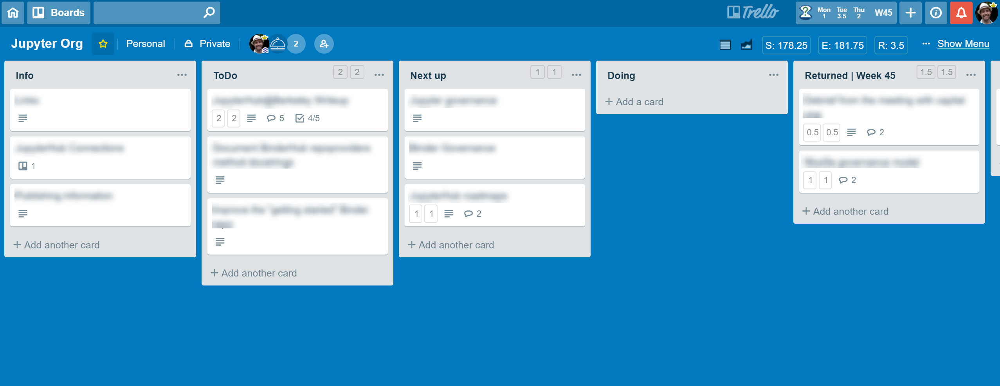
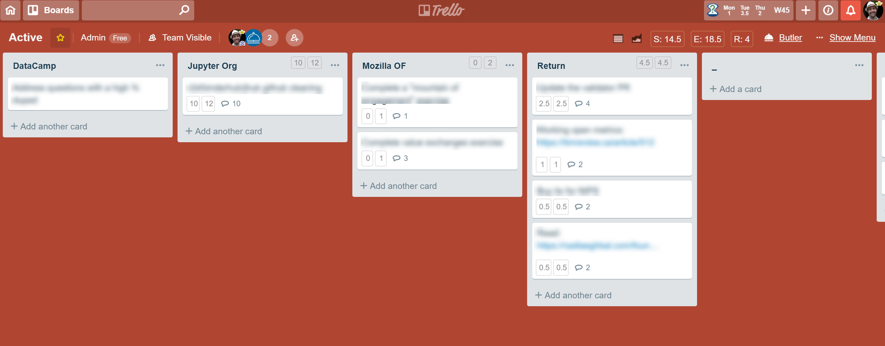

# My weekly workflow

I've had a bunch of conversations with friends who were interested in how to
keep track of the various projects they're working on, and to prioritize their
time over the course of a week. I thought it might be helpful to post my own
approach to planning time throughout the week in case it's useful for others to
riff off of.

## General principles

First off, a few general principles that I use to guide my thinking on planning
out the week.

1. **Be intentional.** This seems obvious, but I find that if I don't explicitly define
   what I want to work on, I have more of those "where the heck did the day go" kinds
   of weeks.
2. **Be strategic.** There are only so many hours in the day, which means that I need to be
   careful about what I commit to spending time on. I try to figure out what are the most
   important things to do, and ensure I make space for this work before other stuff.
3. **Be (conservatively) realistic.** I often get too optimistic with my time and energy levels.
   Sometimes you're tired, sometimes you get distracted, sometimes new work pops up you didn't
   account for. For this reason, I only budget about **20 hours of diligent work a week**.
4. **Be flexible.** Finally, don't worry about following the plan obsessively. Use it as a guide,
   not a set of chains. If it's worth re-prioritizing, that's fine!
5. **Be diligent.** That said, whenever the plans *do* change, make sure that this is written down
   somewhere so that I know I'm being intentional about it.

## What tools do I use?

OK so what does this process actually look like? Here's a general approach:

I use [**Trello**](https://trello.com/) for managing most of the projects that I work on each week. For those who aren't familiar,
Trello is a web app that lets you organize "cards" into vertical lists. It's useful for Kanban-style
project management, and is super popular in technical circles.

I use two kinds of Trello boards, "project" boards, and my "weekly" board.

## Project boards

Project boards are project-specific. They're organized in four primary columns.

* **Info** has cards with information about that project. For example, links, notes, attachments, etc.
* **ToDo** has cards representing tasks that I'll do eventually. These tend to be more abstract and
  will evolve over time.
* **Next** has cards representing actionable tasks that I'll do soon.
* **Doing** is a special list that I'll explain later. It's where cards go when I'm working on them currently.

The other major component of the projcet board is a collection of "Done" lists. At the end of each
week, and cards that are finished get moved into a list named like so: **Done - Week NN** where "NN" is the
number of the current week.

I keep a short-list of currently-active projects that I'm working on. These are "starred" and show up at
the top of the Trello board list to the left.

Here's an example of a project board:




## Weekly board

The other major Trello board that I use is my "weekly" board. This is basically a to-do list for my week.
It's got one list per project, and each card represents a to-do item for that project. There is one-to-one
mapping between lists in this board and project boards that the cards come from.

As I work on cards throughout the week, I move them into another list called "Done". Once the card is there,
it means that I've finished that task for the week.

An additional component is that each card is assigned a number of **hours needed to complete the card**.
I try to keep the total number of hours on this board to <= 20. I've found that this is a realistic
balance between "enough hours to actually get stuff done" and "not so many hours that I won't finish them".

To assign and keep track of the hours with each card, I use a chrome extension called [**Plus for Trello**](https://chrome.google.com/webstore/detail/plus-for-trello-time-trac/gjjpophepkbhejnglcmkdnncmaanojkf?hl=en). This
adds fields for "estimated" and "spent" hours that I update over the week.

Here's an example of a weekly board:




## How does this work in practice?

I use a tool called [**Butler for Trello**](https://butlerfortrello.com/) (BFT) to manage how cards flow through this system.
Lets you automate various tasks in Trello by writing messages that it parses as instructions.

Remember that "Doing" list that I mentioned in each project board? Any time I move a card into
a "Doing" list on a project board, the following happens:

* BFT adds a custom field to the card that has the Project Board ID that it came from
* BFT moves the card to the "weekly" board, to a list with the same name as the project board

Moreover, remember that there was a "Done" list in my weekly board? That also does something
special. I have a BFT link that, whenever clicked, does the following:

* Loop through every card in the "Done" list
* For each card, find the Board ID that represents the board the card came from
* Move the card to that board, put it in a "Done" list that is automatically created using the
  number of the current active week.

So, the general flow of cards through this system looks like this:

1. Create cards in a project board that represent things to be done.
2. When it's time to work on a task, move it to the "Doing" list
3. BFT moves that card to my "Weekly" board, to a list w/ the project name
4. This happens at the beginning of the week, along with an estimation of the time needed for
   each card.
5. As the week progresses, I mark off the hours that I've spent on each card.
6. When the card's hours remaining reaches 0, I move it to the "Done" list
7. At the end of the week, I click my "board cleanup" link, and it returns each card to its
   original project board.
8. Next week, I repeat this cycle.

And that's about it - I've found that this process is a nice way to keep both a high-level
view of what needs to be done for my various projects (on each project board). It also allows
my to dig into specific to-do items throughout the week (on my weekly board).

I'd love to hear feedback and thoughts about how other people manage their time throughout
the week! Hopefully some of you all find this useful.

## Extras

Butler for Trello commands can be a little bit difficult to compose. Below I'll post the
two main commands that I use to handle all the card-moving described above.

### The weekly board

The weekly board has a "butler" list where the command is defined in a card (that's how
you define board-specific BFT commands). Here's the command:


```
script: for each card in list "Return", remove all labels and move the card to list "Returned | Week {weeknumber}" on board "{{%homeboard}}" and move list "Returned | Week {weeknumber}" on board "{{%homeboard}}" to position 1 and clear custom field "homeboard"
```


### A global command for project boards

I also use a global BFT command that moves the cards from each project board to the weekly
board when the card is moved to the "Doing" category.

```
when a card is added to list "Doing" by me, set custom field "homeboard" to "{boardlink}" and move the card to the top of list "{boardname}" on board "Active" and move list "{boardname}" on board "Active" to position 2
```